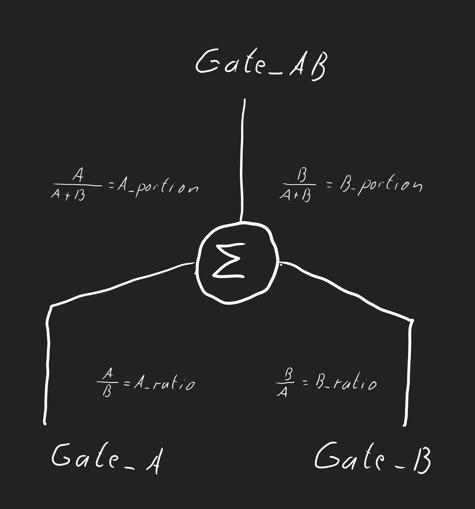

# Binäre Bilanz (Testversion)
Informationen über die Berechnung eines binären Bilanzraumes (Knoten), sowie eine kleine interaktive App zur stellen Berechnung.




Dieses Bild zeigt den Bilanzknoten mit den  extensiven und intensiven Größen

##### Der folgende  Link startet eine mit Voila-Gridstack gerenderte Version.
[](https://mybinder.org/v2/gh/was-ist-immer/Binary_Balance/HEAD?urlpath=voila%2Frender%2FBalance_Binary.ipynb)

##### Der folgende  Link startet Jupyterlab auf Binder um das Programm temporär zu verändern (programmieren).
[](https://mybinder.org/v2/gh/was-ist-immer/Binary_Balance/HEAD?urlpath=lab%2Ftree%2FBalance_Binary.ipynb)


```python

```
