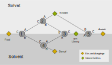

# Massen Bilanzmodell --Kristallisation--
Darstellung und Berechnung eines Massen-Bilanzmodells.

Das Bild zeigt ein einfaches Bilanzkoten-Modell einer Kristallisation.

##### Der folgende  Link startet eine mit Voila gerenderte Version.

##### Der folgende  Link startet Jupyterlab auf Binder um das Programm temporär zu verändern (programmieren).

